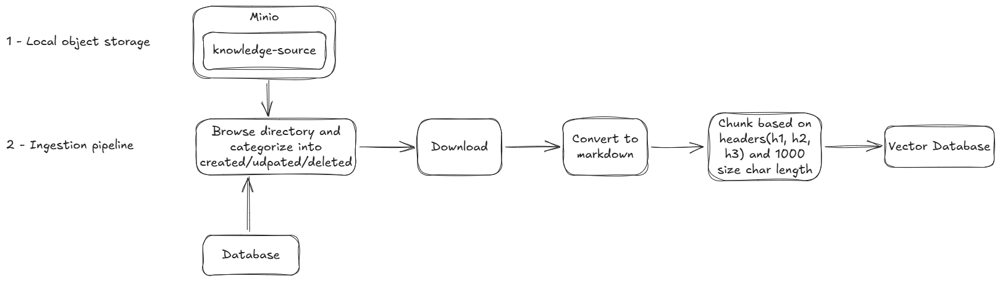

# Knowledge Platform
A production-grade RAG and agent platform for document ingestion, enrichment, hybrid retrieval, reranking, reasoning, evaluation, and observability.

## Architecture


## Running the ingestion pipeline
```sh
uv run python -m knowledge_platform.ingestion.cli --directory source-data/ --reset-on-start
```